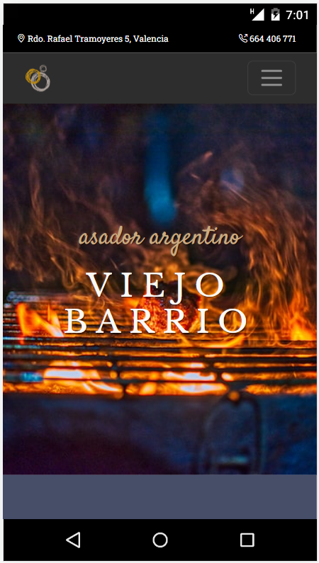
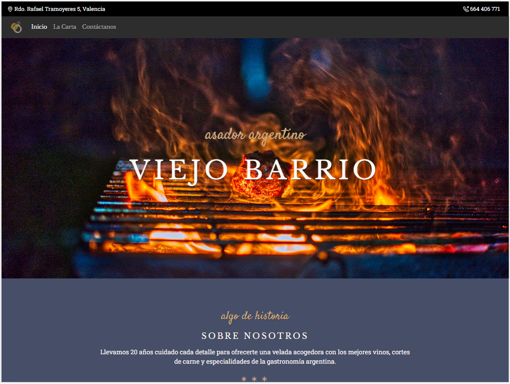

# Restaurant website responsive design
Website of a restaurant establishment created with technologies that allow us to create a fully responsive design. The site consists of three hyperlinked html pages: Home, Contact and Menu.

|||
|Site home page viewed on a Nexus 5|Site home page viewed on an iPad Pro|

URL: https://ilkogarcia.github.io/igp-btc-fsd-pry2-restaurant/

## Table of Contents
1. [General info](#info)
2. [Technologies](#tech)
3. [Installation](#install)
4. [Credits & Acknowledgements](#credits)

## <a name="info"></a>General info
To pass the test it is necessary to create a restaurant website that correctly adapts to the size of different devices. For which, we are expected to use the following technologies: HTML5, CSS3, CSS Layout (Flexbox & Grid) and the Bootstrap framework.

``This project is the second technical test carried out within the scope of the FullStack Developer Bootcamp, held in Valencia, between January and March 2023.``

## <a name="tech"></a>Technologies
Technologies used in the development of the application:

* [HTML5](https://developer.mozilla.org/en-US/docs/Glossary/HTML5)
* [CSS3](https://developer.mozilla.org/en-US/docs/Web/CSS)
* [Bootstrap](https://getbootstrap.com/docs/5.3/getting-started/introduction/)

## <a name="install"></a>Installation
To download the project and open it in your development environment follow the instructions below:

1. Open your browser and navigate to the folder where you want to clone the project.
2. Run Git Bash from that folder.
2. Clone the project. Use the following command line in the Git Bash console.
```
$ git clone https://github.com/ilkogarcia/igp-btc-fsd-pry2-restaurant.git
```
3. From Git Bash, open the project in the development environment.. 
```
$ cd igp-btc-fsd-pry2-restaurant
$code .
```
4. Happy coding!!!

## <a name="credits"></a>Credits and Acknowledgements
The third-party assets used in this project and their license terms are credited below. 

1. We use photos from <a href="https://unsplash.com/@nwarigb?utm_source=unsplash&utm_medium=referral&utm_content=creditCopyText">Nwar Igbariah</a> in <a href="https://unsplash.com/es/fotos/tHbWtMFzZZs?utm_source=unsplash&utm_medium=referral&utm_content=creditCopyText">Unsplash</a>

2. We use photos from <a href="https://unsplash.com/@joseignaciopompe?utm_source=unsplash&utm_medium=referral&utm_content=creditCopyText">José Ignacio Pompé</a> in <a href="https://unsplash.com/es/fotos/s-Z-h0fEiBM?utm_source=unsplash&utm_medium=referral&utm_content=creditCopyText">Unsplash</a>

3. We use photos from <a href="https://unsplash.com/@deby07?utm_source=unsplash&utm_medium=referral&utm_content=creditCopyText">DEBY RODRIGUEZ</a> in <a href="https://unsplash.com/es/fotos/B6kciNEJgN8?utm_source=unsplash&utm_medium=referral&utm_content=creditCopyText">Unsplash</a>

4. We use photos from Vidal Balielo Jr.: https://www.pexels.com/es-es/foto/comida-chef-cocinando-carne-14515097/

5. We use photos from Los Muertos Crew: https://www.pexels.com/es-es/foto/fotografia-de-comida-argentina-empanadas-de-cerca-8279711/

6. We use photos from <a href="https://unsplash.com/@fabmag?utm_source=unsplash&utm_medium=referral&utm_content=creditCopyText">Fabrizio Magoni</a> in <a href="https://unsplash.com/es/fotos/boaDpmC-_Xo?utm_source=unsplash&utm_medium=referral&utm_content=creditCopyText">Unsplash</a>

Additionally I take this opportunity to thank everyone who helped me develop the content found in this repository.